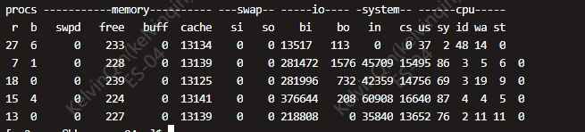
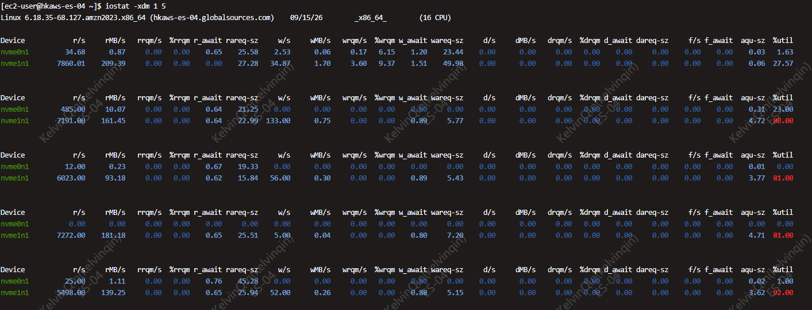

# Linux
### ls
~~~
# 只显示目录
ls -d */

# 只显示文件（不含目录）
ls -p | grep -v /

~~~
## find
~~~
find . -name "ls"
find .  -type f -name 'cer*'
~~~ 

~~~
find . -type f -name "*.tmp" -delete
find . -type f -name "*.tmp" -exec rm {} \;
ls -lh
ls -lhR
ls -lht

~~~

## vim
|按键|功能|
|--|--|
|0	|行首|
|$	|行尾|
|gg	|文件开头|
|G	|文件末尾|
|w	|下一个单词开头|
|b	|上一个单词开头|
|o	|下一行（新建）|
|O	|上一行（新建）|
|dd	|删除整行|
|yy	|复制整行|
|p	|粘贴（光标后）|
|P	|粘贴（光标前）|
|u	|撤销|
|Ctrl+r	|重做|
|/pattern	|向下查找
|?pattern	|向上查找 
|n	|下一个匹配|
|N	|上一个匹配|
|:%s/old/new/	|替换当前行第一个|
|:%s/old/new/g	|替换当前行所有匹配项|
|:%s/old/new/	|替换当前行第一个|
|:%s/old/new/gc	|全局替换，逐个确认|
|:%s/old/new/gi	|全局替换，忽略大小写|

## vmstat -S M 1 5 

~~~
procs   r   b    # r: CPU run queue；b: 等IO的进程数
swap    si  so   # 换入/换出，>0 就要警惕内存不足
io      bi  bo   # 读/写块；bi 很高说明读盘压力大
cpu     us sy id wa st 【us + sy + id + wa + st ≈ 100%】
   -cs  context switches，每秒上下文切换	很高说明线程/进程调度频繁
   -us	用户态 CPU%	ES/Java 干活占用
   -sy	内核态 CPU%	很高可能是 syscall/IO/网络路径过重
   -id	空闲 CPU%	越低越忙
   -wa	iowait CPU%	持续高说明在等磁盘
   -st	steal，被虚拟化层抢走	>0 要怀疑云主机邻居干扰
~~~

## iostat -xdm 1 5

|列| 功能   |关注点|
|--|------|--|
|r/s w/s| 每秒读/写次数 IOPS |是否突然冲高|
|rMB/s wMB/s| 每秒读/写吞吐  |对应 vmstat bi/bo 高|
|r_await w_await| 单次 IO 等待耗时 ms|持续高说明盘慢/队列堵|
|aqu-sz| 平均 IO 队列深度 |高且 await 高 = 堵|
|rareq-sz wareq-sz| 平均请求大小 |大量小 IO 会压 CPU/延迟|
|%util| 设备忙碌百分比 |SSD 接近 100 且 await 高基本到顶|

## top -H -p xxx
~~~
top - 10:03:15 up 84 days, 13:56,  2 users,  load average: 8.61, 10.43, 10.02
    -时间：09:40:39
    -运行时长：已开机 84 天 13 小时（长期未重启）
    -登录用户：2 个
    -负载均值：1 分钟 7.15 / 5 分钟 7.76 / 15 分钟 7.91
Threads: 565 total,   3 running, 562 sleeping,   0 stopped,   0 zombie
    -总线程 256 个
    -10 个处于 running（运行中）
    -246 个 sleeping
    -无 stopped / zombie
%Cpu(s): 42.6 us,  2.1 sy,  0.0 ni, 34.1 id, 21.0 wa,  0.0 hi,  0.2 si,  0.0 st
    -us: 用户态 42.6%
    -sy：内核态 2.1%
    -ni: nice进程
    -id: 空闲34.1%
    -wa: I/O 等待 21%
    -hi/si：硬/软中断
    -st:被虚拟化偷取
MiB Mem :  31554.2 total,    237.6 free,  18179.9 used,  13136.7 buff/cache
    -总内存 31.5 GB
    -free 仅 237 MB，但 buff/cache = 13.1 GB（可回收）
    -已用 18.2 GB
MiB Swap:      0.0 total,      0.0 free,      0.0 used.  12905.5 avail Mem 
    -可用内存 avail = 12.9 GB
    -Swap = 0（未配置 swap）
~~~

